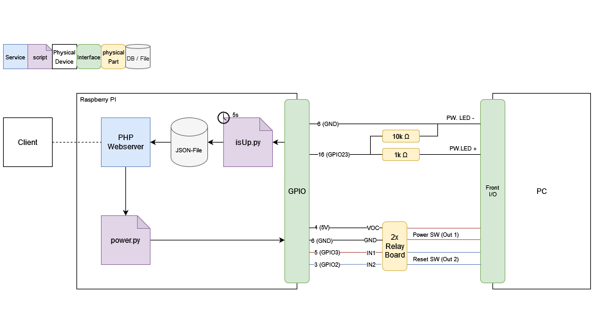
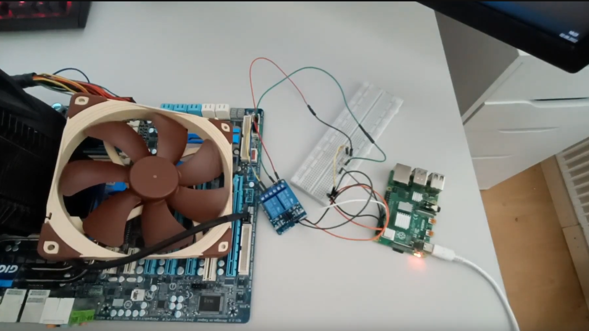

## Links:
- Youtube: https://youtu.be/EMnoliWCj2E

## Key Features

- Remote start / stop and restart of a Computer.

## Detailed Features

### Composition and Architecture

This IoT (Internet of Things) device is engineered using an integrative approach that combines PHP, JavaScript, and Python. At its core, it utilizes a Raspberry Pi (4B model) as the primary computing unit.

An Apache web server is installed on the Raspberry Pi, supporting PHP. Users can interact with the device through a frontend interface developed in HTML, CSS, and JavaScript. This user-friendly interface features an array of functional buttons for efficient control.

<br>
Function drawing:



### User Interface and Control

You can access the webinterface from every browser.
on the webinter face you have a power button, a 5s power button, a reset button and a power led.


Hardware:




---

For an in-depth exploration and understanding of this web application, please refer to the build vlog and review available on YouTube. The source code is accessible for review and contribution on GitHub.

# Setup

sudo apt update && sudo apt upgrade

apit install git -y \
sudo apt install apache2 -y \
sudo apt install php libapache2-mod-php -y

sudo rm /var/www/html/index.html \
cd /var/www/html/ \
sudo git clone https://github.com/HATBE/Remote-Front-IO.git .

sudo chown www-data:www-data /var/www/html -R \ 
sudo chmod 755 /var/www/html -R

sudo nano /etc/apache2/sites-available/000-default.conf

``` text
 DocumentRoot /var/www/html/web
```

sudo systemctl reload apache2

sudo visudo

``` text
www-data ALL=(ALL) NOPASSWD: /usr/bin/python /var/www/html/power.py power
www-data ALL=(ALL) NOPASSWD: /usr/bin/python /var/www/html/power.py powerhard
www-data ALL=(ALL) NOPASSWD: /usr/bin/python /var/www/html/power.py reset
```

sudo nano /etc/systemd/system/rfio.service

``` text
[Unit]
Description=isUp service

[Service]
WorkingDirectory=/var/www/html
User=www-data
Group=www-data
Restart=always
ExecStart=sudo /usr/bin/python /var/www/html/isUp.py

[Install]
WantedBy=multi-user.target
```

sudo systemctl enable rfio \
sudo systemctl start rfio
